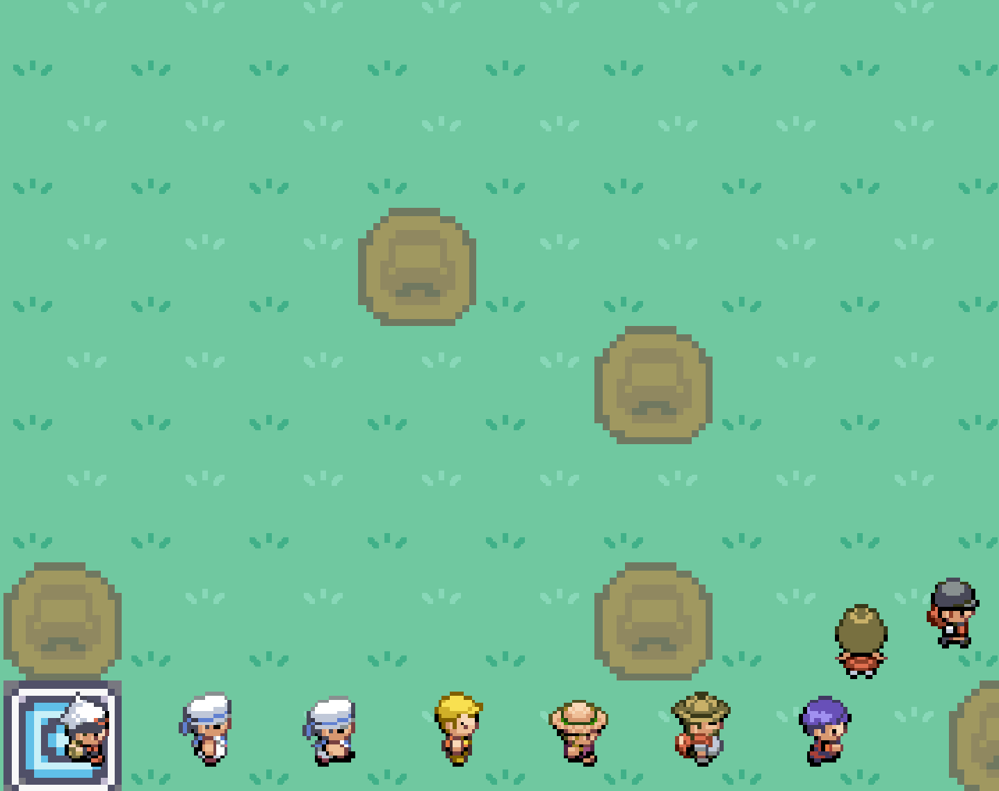
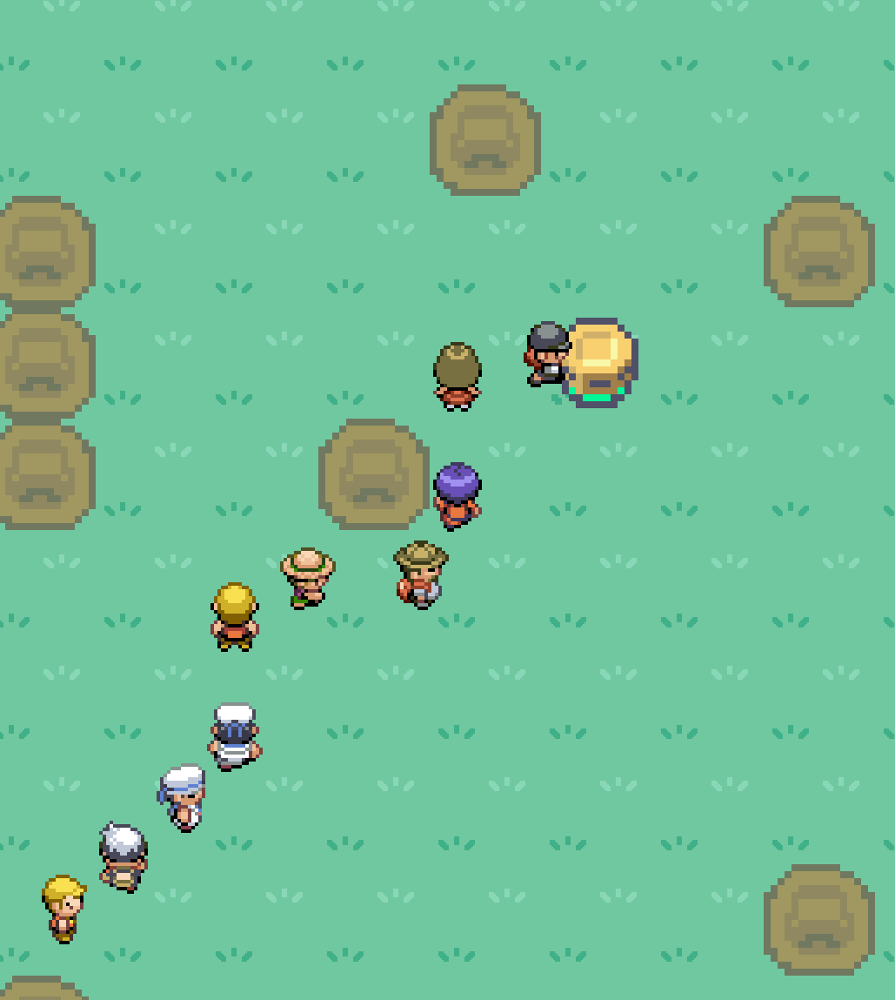
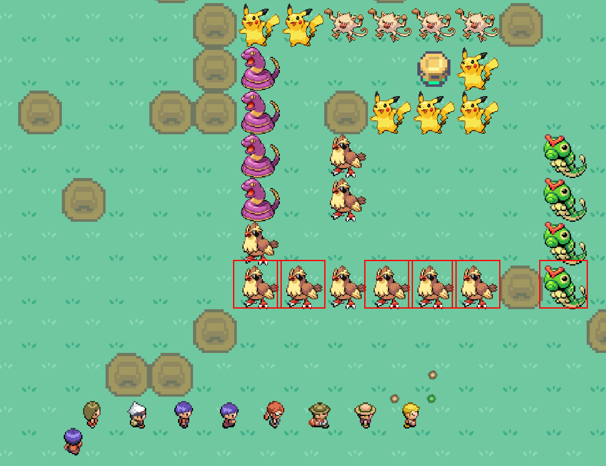

# mmp-032

# How to play
The Trainers are coming from the Spawn



and want to attack the pokal



you have to build Pokèmon Towers to defend it !



## compile for Windows
you need python 3.10.5, because pyinstaller 
```
pip install -U pyinstaller
pyinstaller --clean --noconfirm main.spec
```